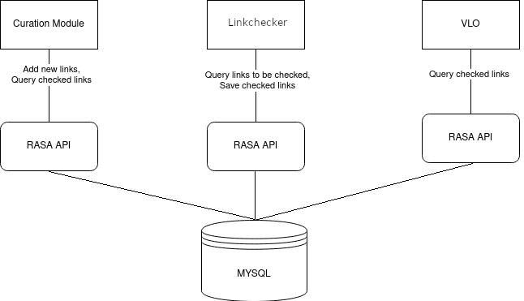

# Resource Availability Status Api

Resource Availability Status Api, aka `RASA`, is a Java API that queries the link checking database of 
the [Curation Module](https://github.com/clarin-eric/clarin-curation-module)
and the [Stormychecker](https://github.com/acdh-oeaw/stormychecker). 
It takes care of the database specific code and provides convenience methods for developers who want to access 
meaningful information extracted from the results of Stormychecker. 
Currently, it supports only MySQL but it is extendible to other databases as well.

### Usage

Add RASA as a dependency to your pom.xml:
```
<dependency>
    <groupId>eu.clarin.cmdi</groupId>
    <artifactId>resource-availability-status-api</artifactId>
    <version>3.0.5</version>
</dependency>
```
Create Rasa Factory with database parameters:
```
RasaFactory factory = new ACDHRasaFactory(DATABASE_URI, DATABASE_USERNAME, DATABASE_PASSWORD);
```
Get the resources:
```
CheckedLinkResource checkedLinkResource = factory.getCheckedLinkResource();
LinkToBeCheckedResource linkToBeCheckedResource = factory.getLinkToBeCheckedResource();
StatisticsResource statisticsResource = factory.getStatisticsResource();
```

**CheckedLink Example:**
Get a checked link by its url:
```
CheckedLink checkedLink = checkedLinkResource.get(url);
```
**Filter Example with CheckedLink:**
Get a stream of checked links by their collection and status:
```
ACDHCheckedLinkFilter filter = new ACDHCheckedLinkFilter(collectionName, status);
try(Stream<CheckedLink> links = checkedLinkResource.get(Optional.of(filter))) {
    //...
}
```
**LinkToBeCheceked Example:**
Save a new link to be checked into the database:
```
LinkToBeChecked linkToBeChecked = new LinkToBeChecked(url, record, collection, expectedMimeType);
linkToBeCheckedResourece.save(linkToBeChecked);
```

**Statistics Example:**
Get overall checked link count and overall average response time:
```
Statistics statistics = statisticsResource.getOverallStatistics();
statistics.getCount(); //the number of all urls in the status table
statistics.getAvgRespTime(); //the average response time of all checked links in the status table
```
**Filter Example with Statistics:**
Count all urls which have the collection "Google" and have broken as true from the status table:
```
acdhStatisticsFilter = new ACDHStatisticsCountFilter("Google", null, true, false, Table.STATUS);
long count = statisticsResource.countTable(acdhStatisticsFilter);
```

### Javadoc
`mvn javadoc:javadoc` will create javadoc files under `target/site/apidocs` From there if you open `index.html` you can browse the javadoc 

### Use Cases:



1. Curation Module fills up the database with new links to be checked via RASA. 
2. Stormychecker queries the database, checks the links and saves them back in the database via RASA.
3. Curation Module provides a daily dump of the database, which VLO copies to its own servers and accesses it via RASA.

### Database Schema
There are three tables in the database that RASA interacts with: `urls`, `status` and `history`. There are also some indexes to help with performance when querying the database. 
Definitive table schema can be found [here](https://github.com/acdh-oeaw/stormychecker/blob/master/tableCreation.sql).

`urls:` This table is the definitive list of all urls. 
Curation Module fills this table up during the weekly update. 
A tuple in this table maps to LinkToBeChecked class in RASA.
    
    url VARCHAR(255): url of the link (primary key)
    nextfetchdate TIMESTAMP: Stormychecker queries the database sorting by nextfetchdate
    host VARCHAR(128): host name of the url, Stormychecker distributes urls according to host to its runners.
    record VARCHAR(255): CMDI Record of the link
    collection VARCHAR(255): CMDI Collection of the link
    expectedMimeType VARCHAR(255): expected mime type of the link extracted from the record
    harvestDate BIGINT(255): Curation Module updates this value during the weekly update. If it is not updated, that means this link used to be in the harvest but was removed, which curation Module then deletes (moves to history).

`status:` This is the table where the latest responses of the checks are persisted. 
Stormychecker reads links from `urls` table, checks them and saves them into this table.
A tuple in this table maps to CheckedLink class in RASA.

    url VARCHAR(255): url of the link (unique and foreign key to urls table, deleted here when deleted from urls table)
    statusCode INT: status code of the response
    method VARCHAR(128): method of the request (HEAD or GET)
    contentType VARCHAR(255): mime type of the response
    byteSize INT: size of the response in bytes
    duration INT: duration of the response in milliseconds
    timestamp TIMESTAMP: timestamp of the response
    redirectCount INT: amount of redirects in total for the link
    record VARCHAR(255): CMDI Record of the link
    collection VARCHAR(255): CMDI Collection of the link
    expectedMimeType VARCHAR(255): expected mime type of the link
    message VARCHAR(255): explanation of the response, ex: why a link was undetermined, or what exception was thrown during the request 
    category VARCHAR(50): category of the response, possible categories: Ok, Broken, Undetermined, Restricted_Access, Blocked_By_Robots_txt
    
`history:` This is the table where links are saved if they were checked more than one time. 
So if a link is already in the `status` table 
and is checked again, then the old checked link is moved here.
A tuple in this table maps to CheckedLink class in RASA.
Schema of this table is the same as 'status' table, however, there is no unique or foreign key constraints.